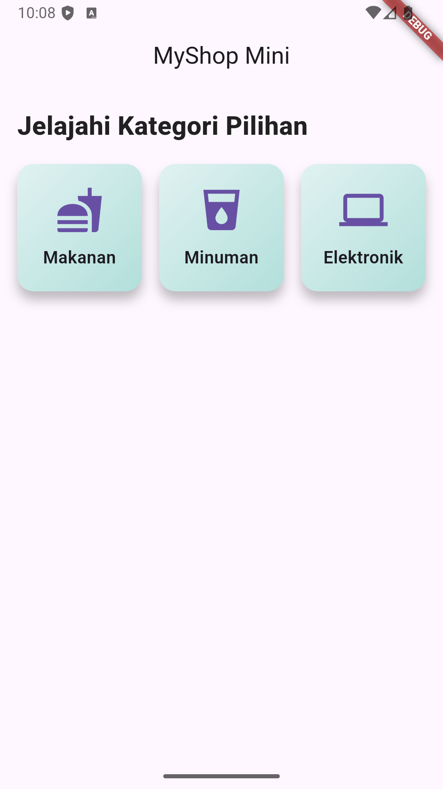
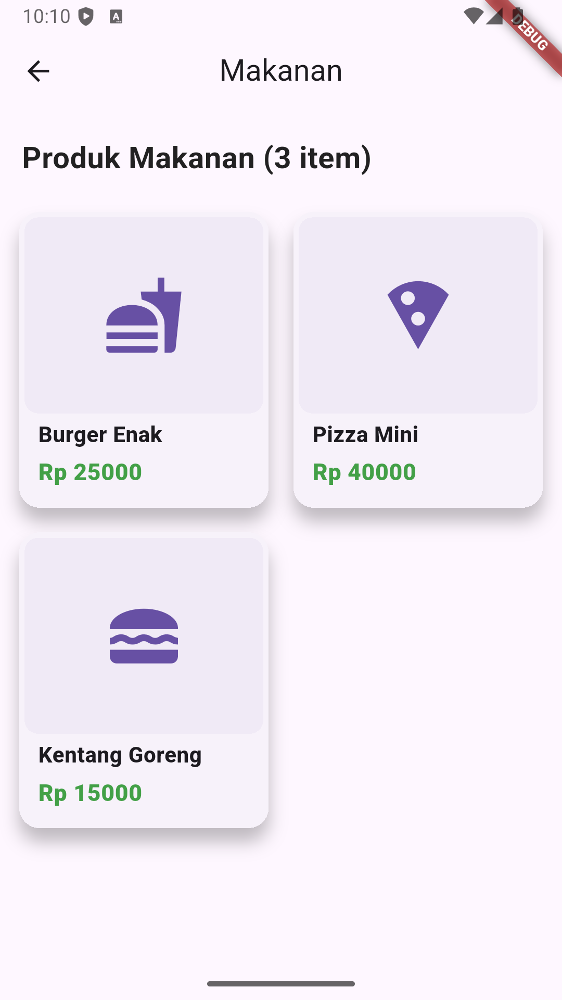
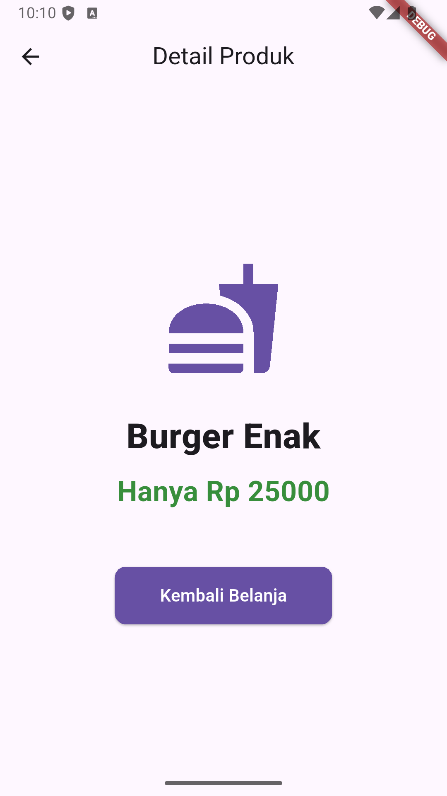

# 🛍️ MyShop Mini | Proyek UTS Mobile Programming (INF23531)

### Nama: REVO NAGARA FISABILHAQ
### Mata Kuliah: Mobile Programming
### Kode MK: INF23531

Aplikasi mobile berbasis **Flutter** ini dikembangkan untuk mengimplementasikan alur navigasi 3 layar dasar pada sistem E-commerce sederhana, sesuai instruksi soal UTS.

---

## 🖼️ Visualisasi dan Custom Styling

Tampilan antarmuka telah ditingkatkan dari default dengan menerapkan **Custom Styling** dan **Visual Polish** untuk meningkatkan *User Experience* (UX) dan kejelasan struktural.

| 🏠 Home Screen (Daftar Kategori) | 🛍️ Product List (Grid 2 Kolom) | 🖼️ Product Detail (Informasi Produk) |
| :---: | :---: | :---: |
|  |  |  |

---

## 🎯 Implementasi Fungsionalitas Inti

Proyek ini telah berhasil mengimplementasikan fungsionalitas dan struktur data yang diminta secara rinci:

### 1. Struktur Data

* Digunakan kelas **`Product`** untuk memodelkan data produk (nama, harga, ikon, **kategori**).
* Data diatur secara **terpusat** dan dimuat berdasarkan pemanggilan di tiap layar.

### 2. Alur Navigasi (Stack Management)

* **`HomeScreen`** $\rightarrow$ Saat *Card* Kategori ditekan, `Navigator.push` digunakan untuk memuat `ProductListScreen` sambil **mengirimkan parameter** `selectedCategory`.
* **`ProductListScreen`** $\rightarrow$ Saat *Card* Produk ditekan, `Navigator.push` digunakan untuk memuat `ProductDetailScreen` sambil **mengirimkan objek** `productData` lengkap.
* **`ProductDetailScreen`** $\rightarrow$ Navigasi kembali dilakukan menggunakan `Navigator.pop`.

### 3. Pembuatan Layar

* **HomeScreen:** Menggunakan `Row` dan `Expanded` untuk memastikan **3 Card Kategori** terdistribusi secara merata.
* **ProductListScreen:** Menggunakan **`GridView.builder`** dengan **`crossAxisCount: 2`** untuk menjamin tampilan Grid 2 kolom, dan data produk ditampilkan berdasarkan hasil **_filtering_** variabel `selectedCategory`.

---

## ⚙️ Analisis Widget dan Fungsi (Jawaban Soal No. 4)

Berikut adalah daftar **Widget Esensial** yang digunakan, beserta fungsi teknisnya dalam pembangunan *project* ini:

| Widget | Fungsi Teknis di Flutter (Rinci) | Implementasi Spesifik |
| :--- | :--- | :--- |
| **`Scaffold`** | Menyediakan API untuk arsitektur visual (misalnya `AppBar`, `body`). | Digunakan untuk struktur dasar pada setiap `Screen`. |
| **`GridView.builder`** | Membangun *layout* 2D array (kisi) secara efisien dengan *lazy loading*. | Digunakan untuk menampilkan Daftar Produk dalam **2 kolom** (`SliverGridDelegateWithFixedCrossAxisCount`). |
| **`GestureDetector`** | Mendeteksi gestur non-material *widget* (seperti *tap*). | **Wajib** digunakan untuk membungkus `Card` agar dapat memicu *event* navigasi. |
| **`Navigator`** | Mengelola *stack* halaman aplikasi. | Digunakan untuk **`Navigator.push`** (maju) dan **`Navigator.pop`** (mundur). |
| **`Card`** | Kontainer dengan visual Material, mendukung `elevation` dan `shape`. | Diberi *elevation* tinggi (`elevation: 8` / `elevation: 10`) untuk efek **kedalaman visual**. |
| **`ThemeData`** | Kelas konfigurasi untuk estetika aplikasi secara global. | Diatur untuk `primarySwatch: Colors.teal` untuk konsistensi visual di seluruh aplikasi. |
| **`Expanded`** | Memungkinkan *widget* anak di dalam `Row`/`Column` mengisi ruang yang tersisa. | Digunakan di `HomeScreen` untuk memastikan 3 `Card` Kategori memiliki lebar yang sama. |

---

## 🚀 Cara Menjalankan Proyek

1.  Clone repositori ini.
2.  Buka terminal, jalankan `flutter pub get`.
3.  Jalankan aplikasi di *device* / emulator: `flutter run`.